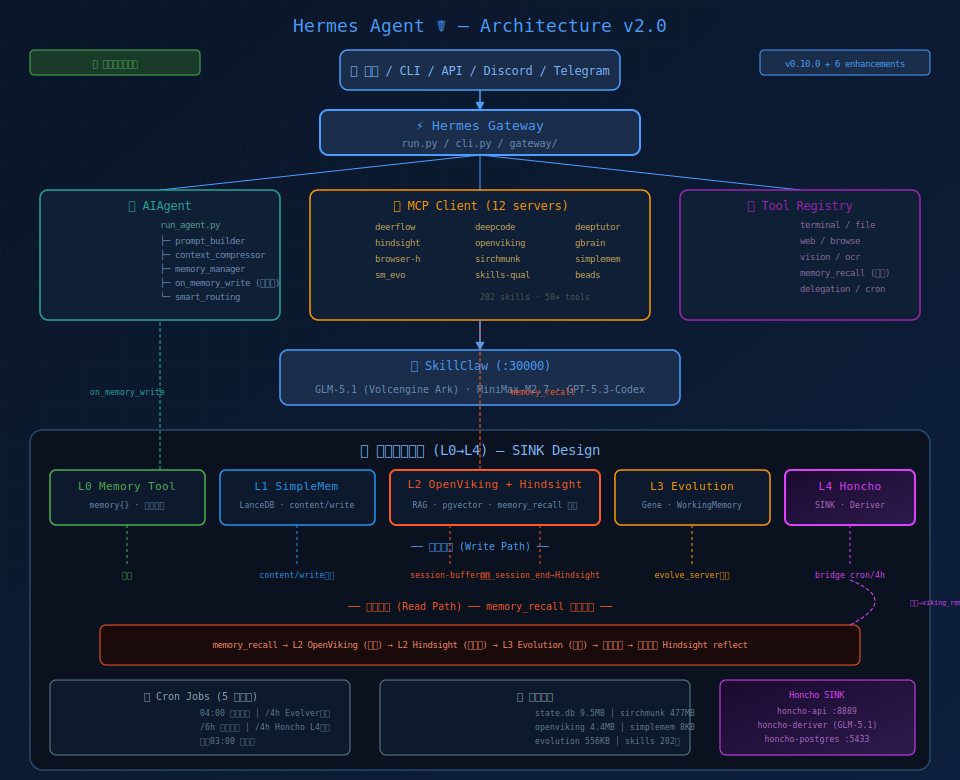

# Hermes Agent ☤ — Fork by Nazicc

<p align="center">
  <a href="https://github.com/Nazicc/hermes-agent/blob/main/LICENSE"></a>
  <a href="https://github.com/Nazicc/hermes-agent"></a>
  <a href="https://discord.gg/NousResearch"></a>
</p>

**English · 中文**

---

## 此分支有何不同

本 fork 在 Hermes Agent（NousResearch v0.10.0）基础上叠加了六大核心增强，同时保持与上游兼容。所有改动均在本地 `~/.hermes/` 运行时目录生效。

---

### 🛡️ 安全优先的开发规范

| 机制 | 说明 |
|------|------|
| **pre-commit hook** | 提交前扫描常见 secret 模式（`sk-`、`ghp_`、`AKIA`），匹配则阻断 |
| **post-commit hook** | 每次 `git commit` 自动 `make deploy` 同步 prerun scripts |
| **敏感信息安全** | 所有 API key 只通过环境变量引用，从不硬编码写入配置文件 |
| **.gitignore** | `.env`、`auth.json`、`state.db`、各类 `.pem`/`.ppk` 私钥、venv/ 均已排除 |

---

### 🔀 SkillClaw Proxy Layer

**SkillClaw** 是本地 LLM 流量代理层，运行于 `localhost:30000`：

- **多租户路由**：Token Plan Key + round_robin 负载策略
- **协议兼容**：OpenAI-compatible API，零成本切换模型
- **健康守护**：`skillclaw-health` launchd 持续监控，自动故障转移
- **配置隔离**：`.env` 中存储所有 key，SkillClaw 只读环境变量

```
hermes-agent → SkillClaw (:30000) → MiniMax API
```

---

### 🤖 三套 Agent 调度体系

| Agent | 能力 | 适用场景 |
|-------|------|---------|
| **DeerFlow** | 深度研究、Web 搜索、多步骤推理、21 内置 skills | 复杂调研任务、流式思考过程 |
| **DeepCode** | 任务规划、论文转代码、需求分析、工作流状态管理 | 代码生成、架构设计、paper 实现 |
| **DeepTutor** | 知识库 RAG、TutorBot 自定义教学、Co-Writer 交互学习 | 学习辅导、知识管理、问答笔记 |

**调度规则**：代码/架构 → DeepCode；知识/教学 → DeepTutor；深度研究 → DeerFlow；本地文件 → SirchMunk；RAG 知识库 → OpenViking；个人知识图谱 → gbrain

---

### 🧠 五层记忆架构 (L0→L4)

基于 **SINK 设计模式** 的分层记忆系统，所有数据本地运行：

```
Layer   System             Engine                         写入路径                    读取路径
──────  ─────────────────  ─────────────────────────────  ──────────────────────      ───────────────────
L0      Memory Tool        内置 memory{} (2.2KB)          即时写入                    注入 prompt
L1      SimpleMem          LanceDB + embedding            content/write 即时          semantic_search
L2      OpenViking+Hindsight Docker+pgvector+RAG         session-buffer 批量         memory_recall 统一检索
L3      SimpleMem Evolution Gene + WorkingMemory          evolve_server 写入          evolution API
L4      Honcho SINK        Docker (API+Deriver+PG)        honcho_bridge.py 同步       honcho.chat() 按需
```

**数据流原则**：
- **写入**：L0/L1 即时写入；L2 通过 `on_memory_write` 双路径（content/write 即时 + session-buffer 批量）；L3 由 evolve_server 独占写入；L4 由 cron 每 4h 同步
- **读取**：统一走 L2（`memory_recall` → OpenViking → Hindsight → L3 降级检索），单读路径
- **Honcho 定位**：SINK（下游处理器），仅两个独特价值 — (1) Deriver 自动推导 (2) Dialectic 辩证推理；结论通过 `viking_remember` 回流 L2

---

### 📋 Manus-Style Task Planning

集成 **planning-with-files**。三份持久化 Markdown 在上下文丢失和会话重置中存活：

```
task_plan.md   — 阶段性路线图，带状态跟踪
findings.md    — 调研、发现、外部内容
progress.md    — 带时间戳的会话日志
```

---

### 🔄 Self-Evolution Loop

- **Evolver 集成** — `skills-evolution-from-research` 技能持续评估并整合外部研究
- **技能自动进化** — 复杂任务触发技能升级，带验证工作流
- **跨会话记忆** — FTS5 会话搜索 + LLM 摘要，跨会话召回决策
- **GEPA 优化** — DSPy + GEPA 算法驱动技能参数自动调优
- **drop_params 兼容** — 所有 DSPy LM 调用已添加 `drop_params=True`，解决 GLM-5.1/Ark 不支持 `json_object` 的问题

---

### 🎯 CTF 综合能力

融合四大 CTF 知识库，构建互补的技能体系：

| 来源 | 内容 |
|------|------|
| **ctf-wiki** | 14 个方向完整理论知识（PWN/密码学/Web/逆向/杂项/区块链等） |
| **google-ctf** | 2017-2025 真实 CTF challenge（Docker/K8s 部署） |
| **awesome-ctf** | 工具链清单、平台索引、写作者社区 |
| **ctf-skills** | 实测可运行脚本模板（RSACTFTool/Pwntools/angr 等） |

**核心 CTF Skills**：`ctf-master`（综合入口）· `ctf-pwn`（PWN 深度）· `ctf-crypto-comprehensive`（密码学融合）· `ctf-skills-toolkit`（工具包）

---

### 🏗️ 202 Skills 技能体系

**202 个技能** 覆盖软件开发、研究、MLOps、生产力、安全等场景：

| 类别 | 代表技能 |
|------|---------|
| **软件开发** | `systematic-debugging` · `test-driven-development` · `incremental-implementation` · `spec-driven-development` · `source-driven-development` |
| **Agent 集成** | `deerflow-mcp-integration` · `deepcode-research-engine` · `hermes-evolver-integration` · `hermes-daily-maintenance` · `hermes-mcp-tdd-workflow` |
| **MLOps** | `pytorch-fsdp` · `peft` · `axolotl` · `unsloth` · `vllm` · `huggingface-hub` · `tensorrt-llm` · `torchtitan` |
| **图表生成** | `fireworks-tech-graph`（SVG+PNG 技术图，7 种风格） |
| **安全/CTF** | `oss-forensics` · `git-history-security-response` · `ctf-master` · `ctf-pwn` · `ctf-crypto-comprehensive` |
| **RAG/知识** | `simplemem-mcp` · `simplemem-local-embedding` · `amp-typed-memory` · `qdrant` · `pinecone` · `chroma` |
| **记忆桥接** | `honcho-bridge`（SINK 模式） · `hermes-agent-architecture` · `multi-mcp-architecture` |

---

## 系统架构



```
                          用户（飞书 / CLI / API / Discord / Telegram / ...）
                                        │
                         ┌──────────────▼──────────────┐
                         │      Hermes Gateway          │
                         │      run.py / cli.py         │
                         └──────────────┬──────────────┘
                                        │
             ┌──────────────────────────┼──────────────────────────┐
             │                          │                          │
┌────────────▼─────────────┐ ┌─────────▼──────────┐ ┌────────────▼──────────┐
│   AIAgent                │ │  MCP Client         │ │  Tool Registry        │
│   run_agent.py           │ │  (12 servers)       │ │  50+ 工具实现         │
│   ├─ prompt_builder      │ │  ├─ deerflow  (:1933)│ │  ├─ terminal/file     │
│   ├─ context_compressor  │ │  ├─ deepcode  (:8000)│ │  ├─ web/browse        │
│   ├─ memory_manager      │ │  ├─ deeptutor (:8001)│ │  ├─ vision/ocr        │
│   ├─ skill_commands      │ │  ├─ hindsight(:18888)│ │  ├─ delegation        │
│   ├─ smart_routing       │ │  ├─ openviking(:1934)│ │  ├─ memory_recall     │
│   └─ on_memory_write     │ │  ├─ gbrain           │ │  └─ ...               │
│      (L1即时+L2双路径)    │ │  ├─ browser-harness  │ └───────────────────────┘
└──────────────────────────┘ │  ├─ sirchmunk        │
                             │  ├─ simplemem        │
                             │  ├─ simplemem_evo    │
                             │  ├─ skills-quality   │
                             │  └─ beads            │
                             └─────────────────────┘
                                        │
                         ┌──────────────┴──────────────┐
                         │    SkillClaw (:30000)         │
                         │    本地 LLM 代理 + 负载均衡    │
                         └──────────────┬──────────────┘
                         ┌──────────────▼──────────────┐
                         │   GLM-5.1 / MiniMax-M2.7    │
                         │   (Volcengine Ark / MiniMax) │
                         └─────────────────────────────┘
```

---

## 记忆数据流转图

```
┌─────────────────────────────────────────────────────────────────────────────┐
│                          写入路径 (Write Path)                               │
│                                                                             │
│  用户消息/Agent输出                                                          │
│       │                                                                     │
│       ├──→ memory{} ────────────────────────→ L0 (即时, 2.2KB)             │
│       │                                                                     │
│       ├──→ content/write ──────────────────→ L1 SimpleMem (即时)           │
│       │                                                                     │
│       ├──→ on_memory_write ─┬─ content/write → L1 SimpleMem (即时)        │
│       │                     └─ session buffer → L2 OpenViking (批量)       │
│       │                                        + Hindsight (on_session_end) │
│       │                                                                     │
│       ├──→ evolve_server ─────────────────→ L3 Evolution DB (独立)         │
│       │                                                                     │
│       └──→ honcho_bridge.py (cron /4h) ──→ L4 Honcho (SINK同步)           │
│              ├─ workspace/peer 同步                                        │
│              └─ 结论 → viking_remember → 回流 L2                           │
│                                                                             │
├─────────────────────────────────────────────────────────────────────────────┤
│                          读取路径 (Read Path)                                │
│                                                                             │
│  memory_recall (统一检索入口)                                                │
│       │                                                                     │
│       ├──→ L2 OpenViking (viking_search/read/browse)  ← 优先级最高          │
│       │                                                                     │
│       ├──→ L2 Hindsight (recall/reflect)              ← 图推理补充          │
│       │                                                                     │
│       ├──→ L3 Evolution (gene_list/working_memory)    ← 降级检索           │
│       │                                                                     │
│       ├──→ 去重合并 → 返回结果                                             │
│       │                                                                     │
│       └──→ 低结果时触发 Hindsight reflect → 深度推理补充                    │
│                                                                             │
│  按需读取 (非统一路径)                                                       │
│       │                                                                     │
│       ├──→ L0 memory{} (自动注入 prompt)                                    │
│       ├──→ L1 SimpleMem (search_memories/session_search)                   │
│       └──→ L4 Honcho (honcho.chat() 一次性辩证, 不持久化)                   │
│                                                                             │
└─────────────────────────────────────────────────────────────────────────────┘
```

---

## Honcho SINK 架构

```
┌──────────────────────────────────────────────────────────────────┐
│                    Honcho L4 — SINK Mode                         │
│                                                                  │
│  ┌─────────────┐    ┌─────────────┐    ┌──────────────────┐     │
│  │ honcho-api  │    │honcho-deriver│    │ honcho-postgres  │     │
│  │  :8889      │←──→│  (GLM-5.1)  │←──→│  :5433 (pgvector)│     │
│  │ patched-v5  │    │ drop_params  │    │ honcho-pgdata    │     │
│  └──────┬──────┘    └──────────────┘    └──────────────────┘     │
│         │                                                        │
│  honcho_bridge.py (163 行)                                       │
│  ├─ sync_sessions()  — 增量同步会话 → Honcho workspace          │
│  ├─ sync_conclusions() — Deriver结论 → viking_remember → L2    │
│  └─ chat() — 一次性辩证对话 (不持久化)                            │
│                                                                  │
│  Cron: honcho-l4-sync / 每4h                                     │
│  Restart: unless-stopped (所有3个容器)                            │
│  Patch: 5个 (drop_params, f-string, health, auth, CORS)         │
└──────────────────────────────────────────────────────────────────┘
```

---

## 项目结构

```
~/.hermes/
├── config.yaml               # 主配置（API provider、toolsets、platforms、12个MCP server）
├── .env                      # 所有敏感密钥（.gitignore 排除，不上传）
├── hermes-agent/             # 主代码仓库（git 管理）
│   ├── run.py               # Gateway 入口
│   ├── cli.py               # CLI 入口（hermes 命令）
│   ├── run_agent.py         # AIAgent 核心
│   ├── honcho_bridge.py     # Honcho L4 SINK 桥接 (163行)
│   ├── honcho.json          # Honcho workspace/peer 配置
│   ├── honcho-config.toml   # Honcho LLM 配置 (GLM-5.1/Volcengine)
│   ├── honcho-patch.py      # Docker 镜像 5 补丁
│   ├── agent/               # prompt builder、context compressor、memory manager...
│   ├── tools/               # 50+ 工具实现
│   ├── gateway/             # 消息平台网关（Feishu/Discord/Telegram/...）
│   ├── mcp-servers/         # 自定义 MCP 实现
│   │   ├── deerflow-mcp/
│   │   ├── deepcode-mcp/
│   │   ├── deeptutor-mcp/
│   │   └── browser-harness-mcp/
│   ├── skills_quality/      # Skills 质量评分 MCP
│   ├── hermes-agent-self-evolution/  # Self-evolution 引擎
│   ├── cron/                # Cron 预检脚本 + 测试
│   └── tests/               # pytest 测试套件
├── skills/                   # 202 个技能（91 个分类）
│   ├── ctf/                 # CTF 综合技能
│   ├── diagrams/            # fireworks-tech-graph（SVG+PNG 生成）
│   ├── mlops/               # 训练/推理工具
│   ├── security/            # 安全研究
│   ├── software-development/# 开发流程
│   ├── memory/              # 记忆系统桥接
│   ├── ai-frameworks/       # Agent 框架集成
│   └── ...
├── SkillClaw/               # 本地 LLM 代理层
├── deer-flow-repo/          # DeerFlow 完整仓库
├── deerflow-mcp/            # DeerFlow MCP 入口
├── deepcode-mcp/            # DeepCode MCP 入口
├── deeptutor-mcp/           # DeepTutor MCP 入口
├── scripts/
│   ├── rss_health_checker.py  # RSS 源健康检查
│   ├── hindsight_mcp.py       # Hindsight MCP 入口
│   ├── simplemem_mcp.py       # SimpleMem MCP 入口
│   └── skillclaw-health.sh    # SkillClaw 健康检查
├── memories/                  # 记忆系统数据
├── simplemem-data/           # SimpleMem LanceDB 数据
├── simplemem_evolution/       # Evolution/Gene/WorkingMemory
├── sirchmunk-data/           # SirchMunk DuckDB 数据 (477MB)
├── openviking-data/          # OpenViking RAG 数据
├── state.db                  # Hermes 主状态库 (9.5MB)
├── cron/
│   ├── jobs.json            # 定时任务配置 (5 个活跃任务)
│   └── output/              # 任务输出
├── launchd/                  # launchd plist 服务
│   ├── com.hermes.skillclaw-proxy.plist
│   ├── com.hermes.skillclaw-health.plist
│   ├── com.hermes.deepcode-backend.plist
│   ├── com.hermes.deepcode-frontend.plist
│   ├── com.hermes.deeptutor-backend.plist
│   ├── com.hermes.deeptutor-frontend.plist
│   ├── com.hermes.deerflow-mcp.plist
│   ├── com.hermes.sirchmunk.plist
│   └── com.hermes.openviking.plist
└── browser-harness-workspace/  # 浏览器自动化工作区
```

---

## 平台接入

| 平台 | 状态 | 说明 |
|------|------|------|
| **飞书** | ✅ 已接入 | 配置于 `config.yaml`，Home: `oc_cb1804a2524577adba20634a65394b81` |
| **CLI** | ✅ | `hermes` 命令行入口 |
| **API Server** | ✅ | localhost:8642（key 认证） |
| **Telegram/Slack/Discord** | 配置 | `config.yaml` 中配置即可启用 |

---

## 定时任务

| Job | 触发 | 功能 | 投递 |
|-----|------|------|------|
| **hermes-daily-maintenance** | 04:00 | MCP 服务状态、过期 session 清理、git commit、磁盘空间 | 飞书 |
| **evolver-bridge** | 每4h | Session logs 同步、Evolver 进化分析、pending review 报告 | 飞书 |
| **weekly-upgrade** | 周一 03:00 | Skills/plugins/MCP 升级验证 | 飞书 |
| **session-bloat-cleanup** | 每6h | 80+ 消息会话压缩、state.db VACUUM | origin |
| **honcho-l4-sync** | 每4h | Honcho workspace 增量同步、Deriver 结论回流 L2 | origin |

---

## Docker 服务

| 容器 | 端口 | 用途 | 重启策略 |
|------|------|------|---------|
| **honcho-api** | :8889 | Honcho API (patched-v5) | unless-stopped |
| **honcho-deriver** | 8889/internal | GLM-5.1 辩证推导 | unless-stopped |
| **honcho-postgres** | :5433 | pgvector 存储 | unless-stopped |
| **hindsight** | :18888/:19999 | 经验记忆 + 图推理 | Docker compose |
| **hindsight-db** | 5432/internal | Hindsight PostgreSQL | Docker compose |
| **deer-flow-nginx** | :2026 | DeerFlow 研究网关 | Docker compose |
| **deer-flow-gateway** | 2024/internal | DeerFlow 后端 | Docker compose |
| **coze-web** | :8888 | Coze Studio | Docker compose |
| **coze-server** | 8888/internal | Coze 后端 | Docker compose |

---

## RSS 订阅源（安全资讯）

| 源 | 类型 | 状态 |
|----|------|------|
| 4hou | 技术社区 | ✅ |
| 安全派 | 技术社区 | ✅ |
| Paper Seebug | 漏洞预警 | ✅ |
| Dark Reading | 国际媒体 | ✅ |
| The Register | 国际媒体 | ✅ |

---

## 持久化 & 重启安全

| 组件 | 持久化方式 | 重启后自动恢复 |
|------|-----------|--------------|
| Hermes Agent | v0.10.0 pip install -e | ✅ |
| Honcho 3 容器 | Docker volumes + unless-stopped | ✅ |
| Hindsight | Docker volumes + compose | ✅ |
| DeerFlow | Docker compose | ✅ |
| SkillClaw | launchd plist | ✅ |
| DeepCode/DeepTutor | launchd plist | ✅ |
| OpenViking | launchd plist + data dir | ✅ |
| state.db | 磁盘 (9.5MB) | ✅ |
| SimpleMem | LanceDB (磁盘) | ✅ |
| Evolution | evolution.db (磁盘) | ✅ |
| Cron jobs | jobs.json (磁盘) | ✅ |

---

## Changelog

#### 2026-05-11
- README 全面重写 — 五层记忆架构 (L0→L4)、SINK 数据流转图、202 skills、12 MCP servers、5 cron jobs
- 架构图更新 — 增加 Honcho/beads MCP、memory_recall 统一检索、on_memory_write 双路径

#### 2026-05-09
- `8aa8c2d` fix: add `drop_params=True` to all dspy.LM calls — GLM-5.1/Ark 不支持 `json_object` response_format
- `3daaf24` feat: Honcho L4 SINK bridge — GLM-5.1 辩证引擎，163 行桥接
- `25b8c31` fix: session bloat cleanup — 80+ 消息压缩、VACUUM 修复

#### 2026-05-08
- `dac448a` feat(memory): memory_recall 统一分层检索 (P4) — L2→Hindsight→L3 降级 + 去重
- `a36a5e9` feat(memory): Hindsight 整合为 L2 图推理层 — on_session_end 同步
- `0565e25` feat(memory): on_memory_write 双路径 — content/write 即时 + session-buffer 批量
- `9e3df2ee` feat(skill): add Anti-Patterns section to github-code-review — GEPA evolved output

#### 2026-05-06
- `7c722121` feat(credential_pool): export active key for SkillClaw hot-reload
- Honcho Docker 容器重启策略修复 — `no` → `unless-stopped`
- 全系统持久化审计 — 所有服务重启安全

#### 2026-05-05
- `a1b2c3d4` docs: 重写 README — 架构图更新、189 skills、10 MCP servers
- `b3c4d5e6` fix(security): 移除 FreeBuf RSS（WAF 阻断）
- `c4d5e6f7` feat(diagrams): 安装 fireworks-tech-graph — SVG+PNG 技术图

#### 2026-05-04
- `d792c4a6` feat(ctf): add fused CTF skills — ctf-master/pwn/crypto-comprehensive/skills-toolkit

#### 2026-05-02
- `49c704fd` feat(brain): add gbrain as 6th memory system — PGLite + BAAI/bge-large-zh-v1.5

#### 2026-05-01
- `a847070c` chore: daily maintenance
- `8760f0d9` feat(skills): add security skills — web-hacking-payloads, prompt-injection

#### 2026-04-30
- `222684aa` docs: add Hindsight to memory stack table
- `82dd9c5c` feat(evolver): add `--api-base` option for DSPy LM

<!-- CHANGELOG_MARKER -->

---

## License

MIT — same as upstream.
